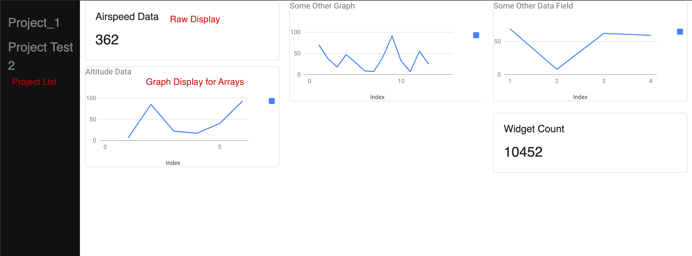
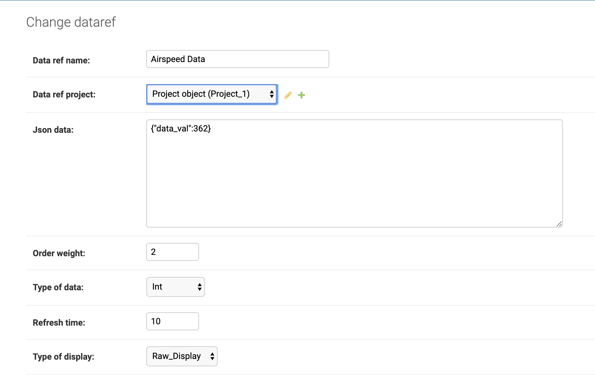

# Cubesat-Groundstation
This is ground station software for a potential cubesat mission for RIT Space Exploration in the near future.  This is still very much a work in progress and will likely see ongoing development.

## Requirements
- Django
- Requests

## Execution
Currently the app is just using the development server so you can type:
`python3 manage.py runserver` at the ground_station directory.

## About

Most ground stations for rockets/satellites/or other smaller scale university projects are typically highly customized and limited in what can be changed.  A change to a piece of data means an update of the codebase to support that data field.  Additionally that 

To remedy some of these issues we came up with a ground station implementation that is meant to be generic enough that it can be used for any missions because the types of data that a given project has is defined by the administrator of the project.  They only need to create a new dataref.

## Dataref
This idea of a dataref, or data reference, is just a reference to some piece of data.  They are tied directly to a project and have unique names, although a different project can have a dataref of the same name as one in another project.

### Updating Dataref
To update the value of a dataref you can use the modify_data function inside of the api.  You can also update the dataref inside of the admin view panel, which can be seen below.

### Data Representation
A dataref can hold the following types of data:
- Integer
- Double
- Integer Array
- Double Array
The data is stored in a string json object in the field Json Data.  This was done for future expandability and to keep things simple.  Additionally it more or less allows for an array to exist inside sqlite database in a fairly efficient manner.

### Dataref Fields
* Data ref name - Name of your dataref
* Data ref project - Foreign key to project
* Json data - String with data.  Data exists in "data_val" field in json. The following are both appropriate: `{"data_val":362}` OR `{"data_val":[362, 623, ...]}`.  The integers can be replaced with doubles if it is a double based dataref.

* Order Weight - Which item to display first on the view.  Sorted starting at 1.
* Type of data - Specify what type of data you want the dataref to represent.
* Refresh time - How often you want to query the server for new information, time in seconds.
* Type of Dispaly - If you want a graph or the raw values.  