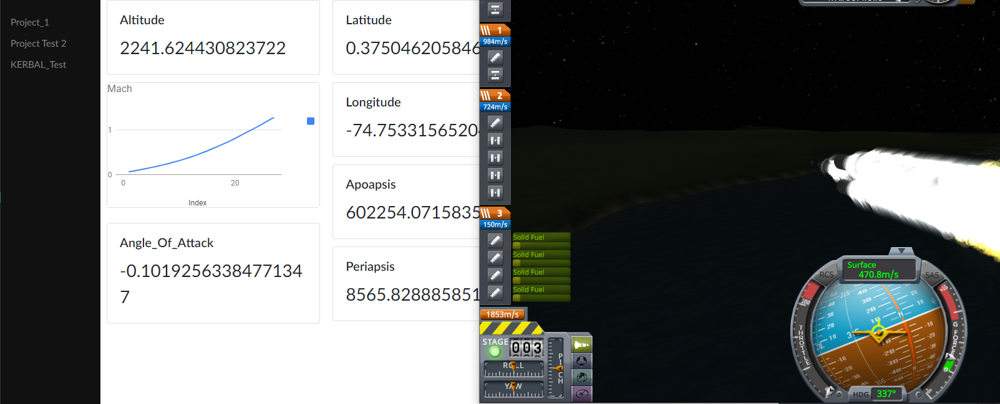

# Kerbal Space Program Example
This is an example of a potential project that the ground station could be used for.

## Description
This calls into the python api to update datarefs in the database.  The user can mimick something
like this by creating the relevant datarefs and making sure the relevant mappings in the kerbal.py file
are correct.

## Purpose
This was only developed as a way to show how easy it is to populate your own data, no matter the type, to
the dataref based system.

## Requirements
* kRPC
* requests

